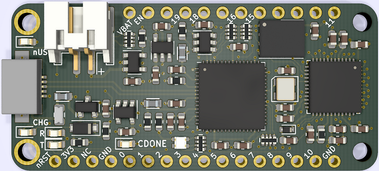
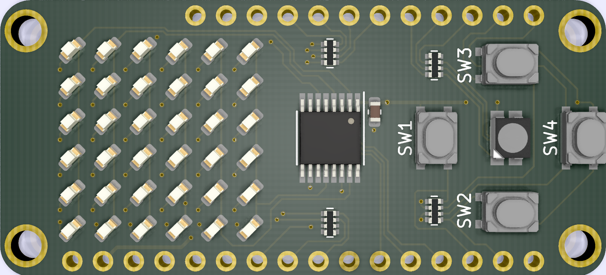
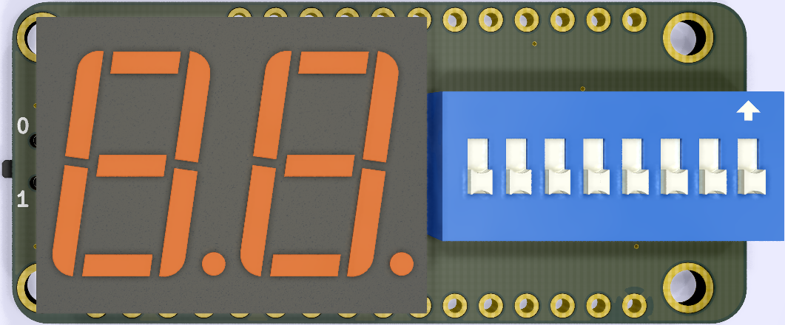

# iCE40-feather
  

## An iCE40UP5K FPGA in an Adafruit Feather form factor

* iCE40UP5k FPGA in a QFN-48 package
    * 5280 Logic Cells
* 20 IO broken out to Feather, 4 additional IO on bottom of board
* FT2232 provides programming and UART interface over a Micro USB connector
* 32 MBit SPI Flash
* Onboard RGB LED, user LED, TX/RX LEDs

### Additional FeatherWings  
* 6x6 LED Matrix + 4 Buttons + RGB LED
* DIP Switch + 7 Segment Display
* Feather to Dual PMOD breakout 

### Software
* Compatible with the open source [IceStorm](http://www.clifford.at/icestorm/#install) toolchain
* Thanks to [Piotr Esden-Tempski](https://twitter.com/esden) and his [iCEBreaker examples](https://github.com/icebreaker-fpga/icebreaker-examples) as a starting point for the firmware development.

### Additional Photos
  

  

  

  